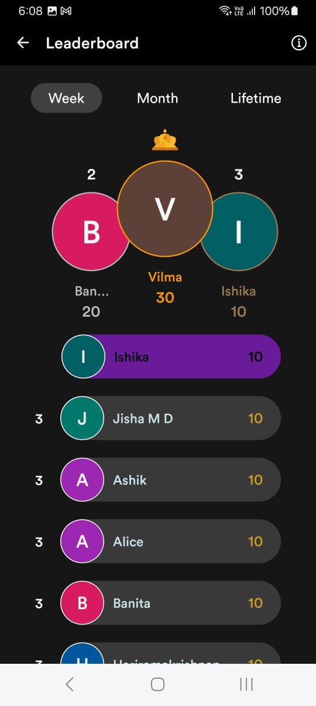

# Managing Profile 

You can add, delete, and update personal information in the Profile option. Track your activities, check the leaderboard scores and your earned coins using the Profile option. You can access this option by tapping Profile in the menu at the bottom of the page. 
## Benefits

Key benefits of the profile option are:
- Personalizing 
- Presence tracking
- Enhancing member engagement
- Community building

## Features
The following features are available in the Profile option:
- My Profile
- Leaderboard
- Guidelines
- Coins Ledger
- Members
- Invite People
- Signout
				
## My Profile
My Profile displays your details that you filled in about yourself such as name, location, and the number of earned coins. 

You can edit or add more details about yourself by tapping Edit Profile at the top of the window. To know more about how to edit your profile, click here.

## Leaderboard
You can view the top three members with the maximum number of coins earned based on the following options:

- Week : Maximum number of coins earned in the current week
- Month : Maximum number of coins earned in the current month 
- Week : Maximum number of coins earned in the entire lifetime as a member.

You can further tap the member’s name or icon to check the member’s profile.   

## Coins Ledger
Coins Ledger displays your earned number of coins and detailed transactions of how and when you earned or spent them. 
## Members
In Member List, you can view all the members who have joined the app along with their joining date. Search for a specific member by typing in the name in the search bar. 

Further, you can also sort the member list in order of their date of joining by tapping the Latest button. It will then display users in order of who joined first. Tap the user’s name to check the profile.

## Invite People
Use this feature to invite people who wish to subscribe to the app. Select the desired app such as Whatsapp or Telegram through which you want to send the link. 

## Sign Out
Tap Sign Out when you wish to sign out of the app.
